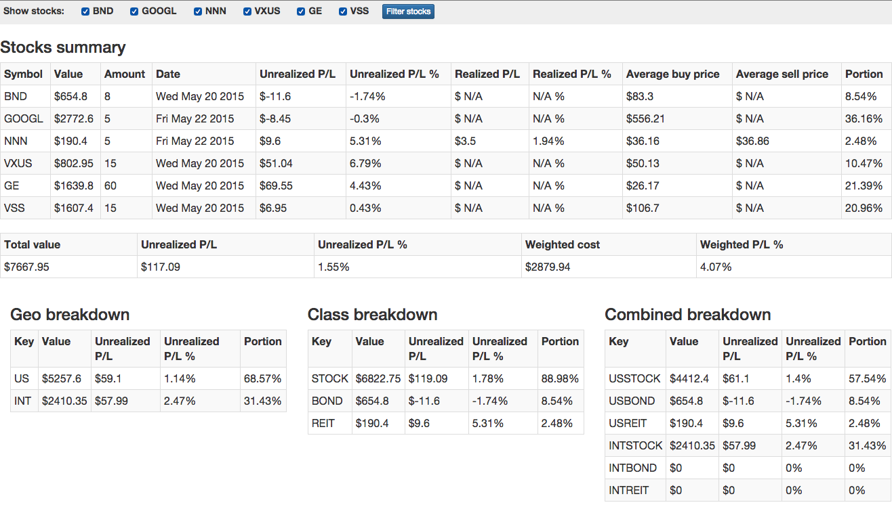

## Overview

This tool can be used to obtain a better idea about your investment portfolio in stocks. It is most suitable for a portfolio consisting of stocks including ETFs.

The tools gives you overview statistics about separate positions, over groups of similar investments (stocks, bonds, REITs, etc) and for the whole portfolio. You can choose to exclude some of the positions and view the statistics without them.

## How it works

For the moment you need to specify the trades made in your portfolio in one CSV file and descriptions of the existing positions you own in a separate CSV file. See the `example_stocks.csv` and `example_trades.csv` files for a better idea. You can specify the files in `lib/constants.js` but they should be in paths starting from the root of the project.

Then you need to run an HTTP server from the root directory of this project, so that you can open the `main.html` page, which will load the CSV data that you have provided.

A very easy to use HTTP server is the one that comes with Python:

```bash
python -m SimpleHTTPServer 3001
```

will run a server on port 3001, which can then be accessed at `localhost:3001/main.html`.

## Details on the data files
For the trades you have several columns per trade. Possible actions are `BUY` and `SELL`, defined in `lib/constants.js`. The rest of the fields should be self-explanatory.

For the stocks, this list should contain descriptions for all stocks mentioned in the trades file. You need to specify if the position covers only US entities or is international (`is_us`). The types that are expected for the moment are `STOCK`, `BOND`, `REIT`. These could be extended through the values in `lib/constants.js`. Let me know if you think that a stock type is missing.

Fund manager for stocks makes sense when it is an ETF. If it the stock of a given company the fields is not so relevant. This field is still not used by the tool. You can also provide a description of the stock. It will show up as a tooltip over the stock symbol. You need to specify a current price and date for the price, so that the tool can calculate returns.

## Details on the visualisations
I suppose most of the values are clear. Just a few comments on the returns. Unrealized P/L shows the return that you would obtain if you sold your positions at the current specified prices. Realized P/L indicates the profil/loss made if there well `SELL` operations in the trades file.

In the table with the total stats `Weighted cost` is an approximation for the dollars that were spent and the amount of time they were hold locked in the positions that you own. This is important because if you follow an investment strategy where you invest at regular intervals and not all money at once in the beginning, most of the money invested was not locked in your investments from the very beginning.

For example, if you spent $1000 at beginning of year 1, another $1000 at beginning of year 2 and so on for 5 years, it would not be completely fair to just take the return at the end of the 5th year and divide it by all the money invested ($5000). Some of this money was available to you earlier and theoretically could have been used for other investment purposes.

`Weighted P/L` takes the weighted cost of the portfolio and uses it compute profit/loss, which in general should be higher than the simple `Unrealized P/L` value.

## Screenshot
Here is a screenshot of how the tool looks:

